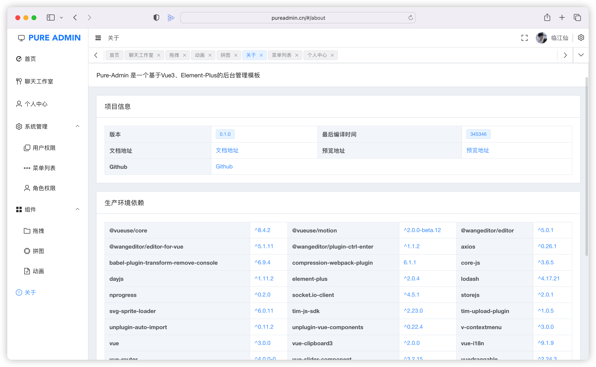

<p align="center">
  <a target="blank">
    
  </a>
  <h2 align="center" style="font-weight: 600;font: bold 200% Consolas, Monaco, monospace;color: #999;">
    PURE ADMIN
  </h2>
  <p align="center">
    使用vue3 + Element-Plus开发 用于学习参考
    <br />
    <a href="https://pureadmin.cn" target="blank">
      <strong>🌎 访问DEMO</strong>
    </a>
    &nbsp;&nbsp;|&nbsp;&nbsp;
    <a><strong>💬 联系作者</strong></a>
    <br />
    <br />
  </p>
</p>


[](https://github.com/Hyk260/PureAdmin/blob/master/LICENSE)

### 🎉 特性

- 📦️ 后端路由动态渲染
- 📃 RBAC 模型 + JWT 权限控制
- ☁️ IM即时通讯 聊天工作室 (开发中)
- 🔴 拼图游戏(九宫格)
- 🌚 光明/黑暗模式切换(自动根据系统主题改变) 开发中...
- ⚡️自定义SVG图标组件
- 🛠 更多特性开发中 


### ✨ 安装使用

Clone 这个 project

```bash
git clone git@gitee.com:H260788/PureAdmin.git
```

安装依赖

```
yarn install
```

安装服务器依赖

```
cd server && yarn install
```

运行服务器 需全局安装 `nodemon`  或者 `cd server && node app`

```
yarn app
```

启动项目

```
yarn serve
```

打包

```
yarn build
```


### 🎨 目录结构

```
├── .vscode                    // 编辑器配置
├── dist                       // 打包文件
├── node_modules               // 依赖包
├── public                     // 静态目录
├── server                     // 服务器
├── src                        // 源代码
│   ├── api                    // 所有请求
│   ├── assets                 // 主题字体图片svg icons等静态资源
│   ├── components             // 全局公用组件
│   ├── locales                // 国际化语言
│   ├── mock                   // mock服务
│   ├── plugins				         // 插件
│   ├── router                 // 路由
│   ├── store                  // 全局 store管理
│   ├── styles                 // 全局样式
│   ├── utils                  // 全局公用方法
│   ├── views                  // view 页面目录
│   ├── App.vue                // 入口页面
│   ├── main.js                // 入口 加载组件 初始化等
├── .babelrc                   // babel-loader 配置
├── eslintrc.js                // eslint 配置项
├── .prettierrc
├── .env.development           // 开发环境变量
├── .env.production			       // 生产环境变量
├── .gitignore                 // git 忽略项
├── README.md                  // 说明
├── jsconfig.json
├── package.json               // 项目名称 项目版本 项目描述 项目运行的一些脚本(依赖)
└── vue.config.js              // vue配置文件
```


### 🖼️ 截图





