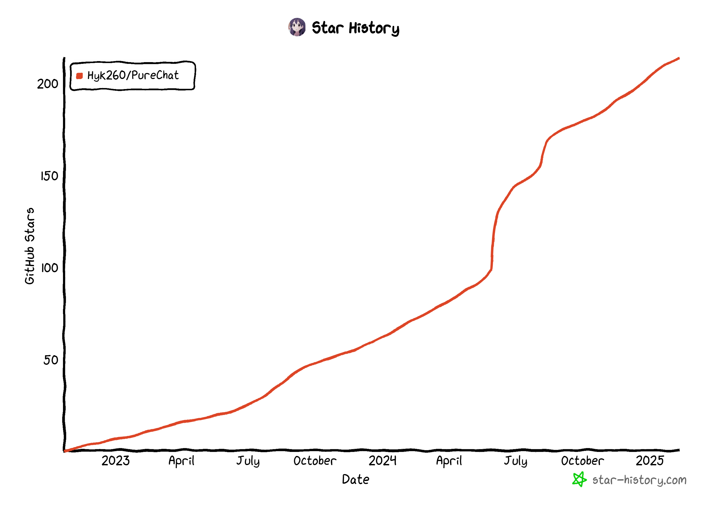
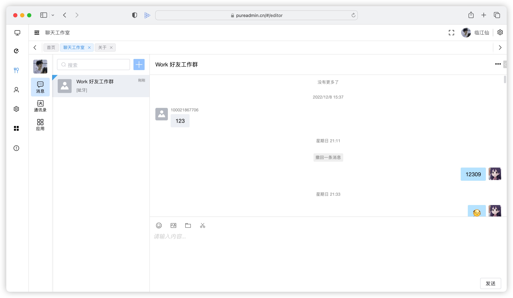
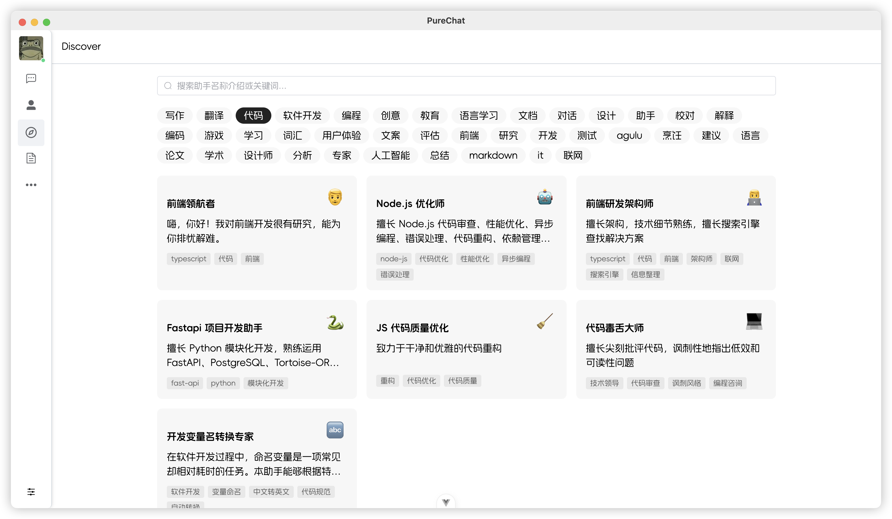

<p align="center">
  <a>
    
  </a>
  <h2 align="center" style="font-weight: 600;font: bold 200% Consolas, Monaco, monospace;color: #999;" >
    PureChat
  </h2>
  <p align="center">
    <span>聊天应用与AI开发框架</span>
    <br />
    <a href="https://purechat.cn" target="blank">
      <strong>🌎 在线预览</strong>
    </a>
    &nbsp;&nbsp;|&nbsp;&nbsp;
    <a href="https://jq.qq.com/?_wv=1027&k=Cd4Ihd2J" target="blank">
      <strong>💬 联系作者</strong>
    </a>
    <br />
    <br />
  </p>
</p>

[![Web][Web-image]][web-url]
[![Windows][Windows-image]][download-url]
<!-- [![Release][github-release-shield]][github-release-link] -->
[![MacOS][MacOS-image]][download-url]
[![deepwiki][deepwiki-shield]][deepwiki-link]
[![Docs][docs-shield]][docs-link]
[](https://github.com/Hyk260/PureChat/blob/master/LICENSE)

<!-- SHIELD GROUP -->

[](https://github.com/Hyk260/PureChat/stargazers)
[](https://github.com/Hyk260/PureChat/network/members)

## 简介

[反馈](https://github.com/Hyk260/PureChat/issues) /
[QQ 群](https://github.com/Hyk260/PureChat/discussions/2) /
[打赏开发者](./images/weix.png) /
[文档](https://docs.purechat.cn) /
[更新日志](https://docs.purechat.cn/other/logs.html)

### 🎉 特性

- 📦️ 基于Vue3，Vite6构建高效应用
- 📸 聊天记录支持生成截图并支持一键复制
- 💡 会话基于腾讯IM即时通讯SDK
- 🌙 根据系统主题自动切换光明与黑暗模式
- 📝 支持Markdown渲染，代码高亮，链接识别
- 🛡️ GitHub快速登录，享受无缝社交体验
- ☁️ 多模型支持OpenAI、Ollama、DeepSeek 等，支持联网搜索，流式输出，深度思考，自定义预设提示词
- ✨ 提供桌面应用Electron版本，支持macOS(.dmg)与Windows(.exe)
- 🛠  更多特性持续开发中

### 环境配置

本地环境需要安装 Node.js 18.20+

### 克隆代码

```bash
git clone https://github.com/Hyk260/PureChat.git
```

### 安装依赖

```bash
pnpm install
```

### 启动项目

```bash
pnpm dev
```

### 打包

```bash
pnpm build
```

### 📊 GitHub Stats


### Star History
<!-- https://star-history.com/ -->
<!--  -->

[](https://www.star-history.com/#Hyk260/PureChat&Date)

### 🖼️ 截图






### 环境变量

本项目提供了一些额外的配置项，使用环境变量进行设置：

| 环境变量                | 类型 |                             描述                             |                             示例                             |
| :---------------------- | :--: | :----------------------------------------------------------: | :----------------------------------------------------------: |
| `VITE_OPENAI_API_KEY`   | 必选 |                       OpenAI API 密钥                        |                     `sk-xxxxxx...xxxxxx`                     |
| `VITE_OPENAI_PROXY_URL` | 可选 |   OpenAI 接口代理，此配置可以覆盖默认 OpenAI API 基础 URL    | `https://aihubmix.com/v1`<br/>默认值:<br/>`https://api.openai.com/v1` |
| `VITE_IM_SDK_APPID`     | 必选 |     腾讯IM SDKAppID https://cloud.tencent.com/product/im     |                           `xxxxxx`                           |
| `VITE_SERVICE_BASE_URL` | 必选 |                          服务器地址                          |                   `https://your.api.com/`                    |                          `Y`                              |

### 模型服务商

| 服务商                                                   | 状态 | 备注                                         |
| -------------------------------------------------------- | ---- | -------------------------------------------- |
| [AiHubMix](https://aihubmix.com/?aff=8DBz)               | ✅    | 一站式对接各种大模型。让开发更智能、更高效。 |
| [胜算云](https://www.shengsuanyun.com/?from=CH_XZG5OKZS) | ✅    | 全球大模型都可调用（友情推荐）               |
| [302.AI](https://share.302.ai/S7BSJA)                    | ✅    | 企业级AI资源平台，按用量付费，全模型API接入  |

【胜算云】点击享百万Tokens免费试用额度：[链接](https://www.shengsuanyun.com/?from=CH_XZG5OKZS)

【302.AI】点击免费试用$1额度：[链接](https://share.302.ai/S7BSJA)


<!-- LINK GROUP -->

[web-url]: https://purechat.cn

[download-url]: https://github.com/Hyk260/PureChat/releases
[Web-image]: https://img.shields.io/badge/Web-orange?logo=microsoftedge
[Windows-image]: https://img.shields.io/badge/-Windows-blue?logo=windows
[MacOS-image]: https://img.shields.io/badge/-MacOS-black?logo=apple

<!-- Links & Images -->
[docs-shield]:https://img.shields.io/badge/PureChat-%E6%96%87%E6%A1%A3-blue
[deepwiki-shield]: https://img.shields.io/badge/Deepwiki-PureChat-0088CC?logo=data:image/svg+xml;base64,PHN2ZyB4bWxucz0iaHR0cDovL3d3dy53My5vcmcvMjAwMC9zdmciIHZpZXdCb3g9IjAgMCAyNy45MyAzMiI+PHBhdGggZD0iTTE5LjMzIDE0LjEyYy42Ny0uMzkgMS41LS4zOSAyLjE4IDBsMS43NCAxYy4wNi4wMy4xMS4wNi4xOC4wN2guMDRjLjA2LjAzLjEyLjAzLjE4LjAzaC4wMmMuMDYgMCAuMTEgMCAuMTctLjAyaC4wM2MuMDYtLjAyLjEyLS4wNS4xNy0uMDhoLjAybDMuNDgtMi4wMWMuMjUtLjE0LjQtLjQxLjQtLjdWOC40YS44MS44MSAwIDAgMC0uNC0uN2wtMy40OC0yLjAxYS44My44MyAwIDAgMC0uODEgMEwxOS43NyA3LjdoLS4wMWwtLjE1LjEyLS4wMi4wMnMtLjA3LjA5LS4xLjE0VjhhLjQuNCAwIDAgMC0uMDguMTd2LjA0Yy0uMDMuMDYtLjAzLjEyLS4wMy4xOXYyLjAxYzAgLjc4LS40MSAxLjQ5LTEuMDkgMS44OC0uNjcuMzktMS41LjM5LTIuMTggMGwtMS43NC0xYS42LjYgMCAwIDAtLjIxLS4wOGMtLjA2LS4wMS0uMTItLjAyLS4xOC0uMDJoLS4wM2MtLjA2IDAtLjExLjAxLS4xNy4wMmgtLjAzYy0uMDYuMDItLjEyLjA0LS4xNy4wN2gtLjAybC0zLjQ3IDIuMDFjLS4yNS4xNC0uNC40MS0uNC43VjE4YzAgLjI5LjE1LjU1LjQuN2wzLjQ4IDIuMDFoLjAyYy4wNi4wNC4xMS4wNi4xNy4wOGguMDNjLjA1LjAyLjExLjAzLjE3LjAzaC4wMmMuMDYgMCAuMTIgMCAuMTgtLjAyaC4wNGMuMDYtLjAzLjEyLS4wNS4xOC0uMDhsMS43NC0xYy42Ny0uMzkgMS41LS4zOSAyLjE3IDBzMS4wOSAxLjExIDEuMDkgMS44OHYyLjAxYzAgLjA3IDAgLjEzLjAyLjE5di4wNGMuMDMuMDYuMDUuMTIuMDguMTd2LjAycy4wOC4wOS4xMi4xM2wuMDIuMDJzLjA5LjA4LjE1LjExYzAgMCAuMDEgMCAuMDEuMDFsMy40OCAyLjAxYy4yNS4xNC41Ni4xNC44MSAwbDMuNDgtMi4wMWMuMjUtLjE0LjQtLjQxLjQtLjd2LTQuMDFhLjgxLjgxIDAgMCAwLS40LS43bC0zLjQ4LTIuMDFoLS4wMmMtLjA1LS4wNC0uMTEtLjA2LS4xNy0uMDhoLS4wM2EuNS41IDAgMCAwLS4xNy0uMDNoLS4wM2MtLjA2IDAtLjEyIDAtLjE4LjAyLS4wNy4wMi0uMTUuMDUtLjIxLjA4bC0xLjc0IDFjLS42Ny4zOS0xLjUuMzktMi4xNyAwYTIuMTkgMi4xOSAwIDAgMS0xLjA5LTEuODhjMC0uNzguNDItMS40OSAxLjA5LTEuODhaIiBzdHlsZT0iZmlsbDojNWRiZjlkIi8+PHBhdGggZD0ibS40IDEzLjExIDMuNDcgMi4wMWMuMjUuMTQuNTYuMTQuOCAwbDMuNDctMi4wMWguMDFsLjE1LS4xMi4wMi0uMDJzLjA3LS4wOS4xLS4xNGwuMDItLjAyYy4wMy0uMDUuMDUtLjExLjA3LS4xN3YtLjA0Yy4wMy0uMDYuMDMtLjEyLjAzLS4xOVYxMC40YzAtLjc4LjQyLTEuNDkgMS4wOS0xLjg4czEuNS0uMzkgMi4xOCAwbDEuNzQgMWMuMDcuMDQuMTQuMDcuMjEuMDguMDYuMDEuMTIuMDIuMTguMDJoLjAzYy4wNiAwIC4xMS0uMDEuMTctLjAyaC4wM2MuMDYtLjAyLjEyLS4wNC4xNy0uMDdoLjAybDMuNDctMi4wMmMuMjUtLjE0LjQtLjQxLjQtLjd2LTRhLjgxLjgxIDAgMCAwLS40LS43bC0zLjQ2LTJhLjgzLjgzIDAgMCAwLS44MSAwbC0zLjQ4IDIuMDFoLS4wMWwtLjE1LjEyLS4wMi4wMi0uMS4xMy0uMDIuMDJjLS4wMy4wNS0uMDUuMTEtLjA3LjE3di4wNGMtLjAzLjA2LS4wMy4xMi0uMDMuMTl2Mi4wMWMwIC43OC0uNDIgMS40OS0xLjA5IDEuODhzLTEuNS4zOS0yLjE4IDBsLTEuNzQtMWEuNi42IDAgMCAwLS4yMS0uMDhjLS4wNi0uMDEtLjEyLS4wMi0uMTgtLjAyaC0uMDNjLS4wNiAwLS4xMS4wMS0uMTcuMDJoLS4wM2MtLjA2LjAyLS4xMi4wNS0uMTcuMDhoLS4wMkwuNCA3LjcxYy0uMjUuMTQtLjQuNDEtLjQuNjl2NC4wMWMwIC4yOS4xNS41Ni40LjciIHN0eWxlPSJmaWxsOiM0NDY4YzQiLz48cGF0aCBkPSJtMTcuODQgMjQuNDgtMy40OC0yLjAxaC0uMDJjLS4wNS0uMDQtLjExLS4wNi0uMTctLjA4aC0uMDNhLjUuNSAwIDAgMC0uMTctLjAzaC0uMDNjLS4wNiAwLS4xMiAwLS4xOC4wMmgtLjA0Yy0uMDYuMDMtLjEyLjA1LS4xOC4wOGwtMS43NCAxYy0uNjcuMzktMS41LjM5LTIuMTggMGEyLjE5IDIuMTkgMCAwIDEtMS4wOS0xLjg4di0yLjAxYzAtLjA2IDAtLjEzLS4wMi0uMTl2LS4wNGMtLjAzLS4wNi0uMDUtLjExLS4wOC0uMTdsLS4wMi0uMDJzLS4wNi0uMDktLjEtLjEzTDguMjkgMTlzLS4wOS0uMDgtLjE1LS4xMWgtLjAxbC0zLjQ3LTIuMDJhLjgzLjgzIDAgMCAwLS44MSAwTC4zNyAxOC44OGEuODcuODcgMCAwIDAtLjM3LjcxdjQuMDFjMCAuMjkuMTUuNTUuNC43bDMuNDcgMi4wMWguMDJjLjA1LjA0LjExLjA2LjE3LjA4aC4wM2MuMDUuMDIuMTEuMDMuMTYuMDNoLjAzYy4wNiAwIC4xMiAwIC4xOC0uMDJoLjA0Yy4wNi0uMDMuMTItLjA1LjE4LS4wOGwxLjc0LTFjLjY3LS4zOSAxLjUtLjM5IDIuMTcgMHMxLjA5IDEuMTEgMS4wOSAxLjg4djIuMDFjMCAuMDcgMCAuMTMuMDIuMTl2LjA0Yy4wMy4wNi4wNS4xMS4wOC4xN2wuMDIuMDJzLjA2LjA5LjEuMTRsLjAyLjAycy4wOS4wOC4xNS4xMWguMDFsMy40OCAyLjAyYy4yNS4xNC41Ni4xNC44MSAwbDMuNDgtMi4wMWMuMjUtLjE0LjQtLjQxLjQtLjdWMjUuMmEuODEuODEgMCAwIDAtLjQtLjdaIiBzdHlsZT0iZmlsbDojNDI5M2Q5Ii8+PC9zdmc+
[deepwiki-link]: https://deepwiki.com/Hyk260/PureChat
[docs-link]: https://docs.purechat.cn
[github-release-shield]: https://img.shields.io/github/v/release/PureChat/pure-chat?logo=github
[github-release-link]: https://github.com/Hyk260/PureChat/releases
