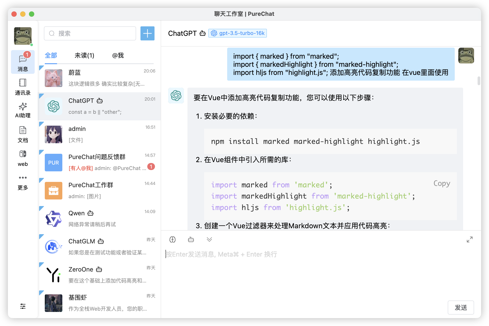
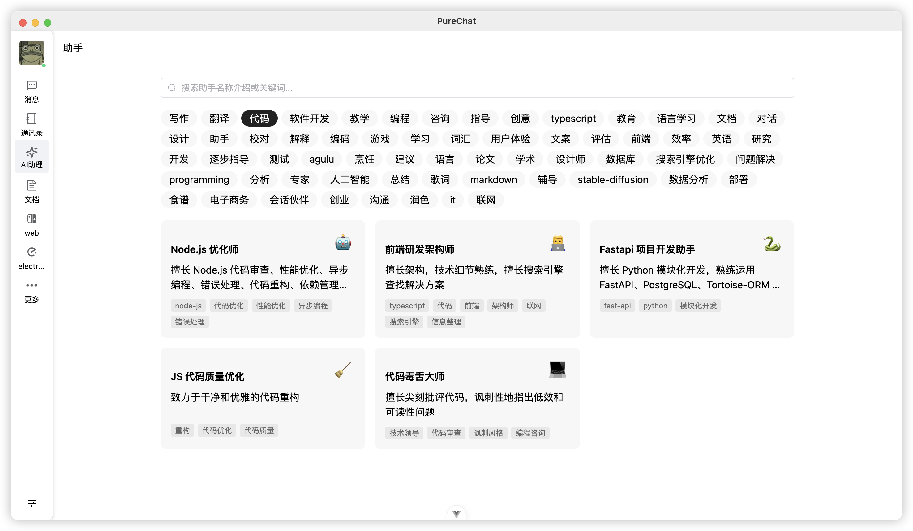
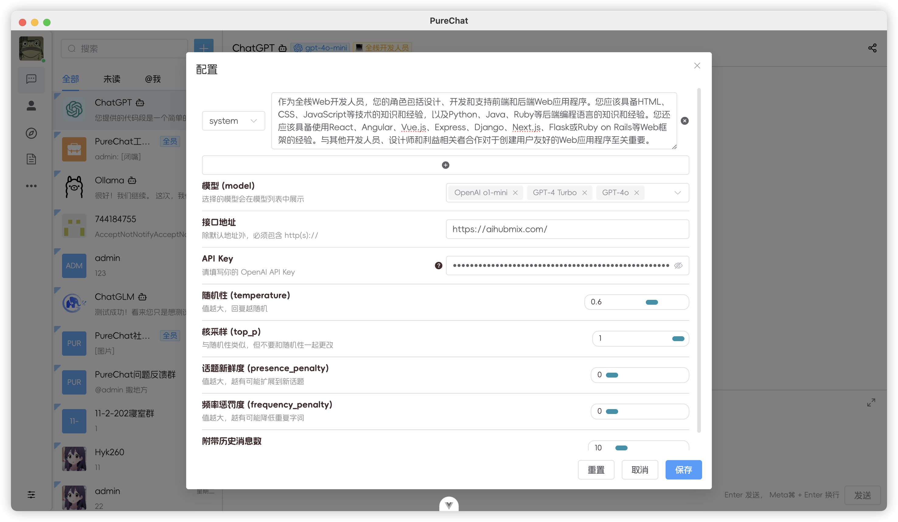

<p align="center">
  <a>
    
  </a>
  <h2 align="center" style="font-weight: 600;font: bold 200% Consolas, Monaco, monospace;color: #999;" >
    PureChat
  </h2>
  <p align="center">
    <span>聊天应用与AI开发框架</span>
    <br />
    <a href="https://purechat.cn" target="blank">
      <strong>🌎 在线预览</strong>
    </a>
    &nbsp;&nbsp;|&nbsp;&nbsp;
    <a href="https://jq.qq.com/?_wv=1027&k=Cd4Ihd2J" target="blank">
      <strong>💬 联系作者</strong>
    </a>
    <br />
    <br />
  </p>
</p>

[![Web][Web-image]][web-url]
[![Windows][Windows-image]][download-url]
[![MacOS][MacOS-image]][download-url]

<!-- SHIELD GROUP -->

[](https://github.com/Hyk260/PureChat/blob/master/LICENSE)
[](https://github.com/Hyk260/PureChat/stargazers)
[](https://github.com/Hyk260/PureChat/network/members)

## 简介

[反馈](https://github.com/Hyk260/PureChat/issues) /
[QQ 群](https://github.com/Hyk260/PureChat/discussions/2) /
[打赏开发者](./images/weix.png) /
[文档](https://hyk260.github.io/pure-docs) /
[更新日志](https://hyk260.github.io/pure-docs/other/logs.html)

[PureChat](https://github.com/Hyk260/PureChat) 是一个集成 ChatGPT 的聊天应用。

### 🎉 特性

- 📦️ 基于 Vite5，构建高效应用
- 📸 聊天记录支持生成截图并支持一键复制
- ☁️ 会话基于 IM 即时通讯 SDK
- 🌙 根据系统主题自动切换光明与黑暗模式
- 📝 支持 Markdown 渲染，代码高亮，链接识别
- 🛡️ GitHub 快速登录，享受无缝社交体验
- 🤖 集成 ChatGPT Ollama等大语言模型，支持流式输出 预设提示词 以及上下文
- ✨ 提供桌面应用 Electron 版本，支持 macOS (.dmg) 与 Windows (.exe)
- 🛠 更多特性持续开发中

环境配置

```
本地环境需要安装 Node.js 18.20+
```

克隆代码

```bash
git clone https://github.com/Hyk260/PureChat.git
```

安装依赖

```
pnpm install
```

启动项目

```
pnpm dev
```

打包

```
pnpm build
```

### Star History


### 🖼️ 截图








### 环境变量

本项目提供了一些额外的配置项，使用环境变量进行设置：

| 环境变量                | 类型 | 描述                                                  | 示例                                                                  |
| -------------------    | ---- | ------------------------------------------------------| ------------------------------------------------                     |
| `VITE_OPENAI_API_KEY`  | 必选 |  OpenAI API 密钥                                       | `sk-xxxxxx...xxxxxx`                                                 |
| `VITE_OPENAI_PROXY_URL`| 可选 |  OpenAI 接口代理，此配置可以覆盖默认 OpenAI API 基础 URL | `https://aihubmix.com/v1`<br/>默认值:<br/>`https://api.openai.com/v1` |
| `VITE_IM_SDK_APPID`    | 必选 | 腾讯IM SDKAppID https://cloud.tencent.com/product/im   | `xxxxxx`                                                             |
| `VITE_SERVICE_BASE_URL`| 必选 | 服务器地址                                             | `https://your.api.com/`                                               |

<!-- LINK GROUP -->

[web-url]: https://purechat.cn
[download-url]: https://github.com/Hyk260/PureChat/releases
[Web-image]: https://img.shields.io/badge/Web-orange?logo=microsoftedge
[Windows-image]: https://img.shields.io/badge/-Windows-blue?logo=windows
[MacOS-image]: https://img.shields.io/badge/-MacOS-black?logo=apple