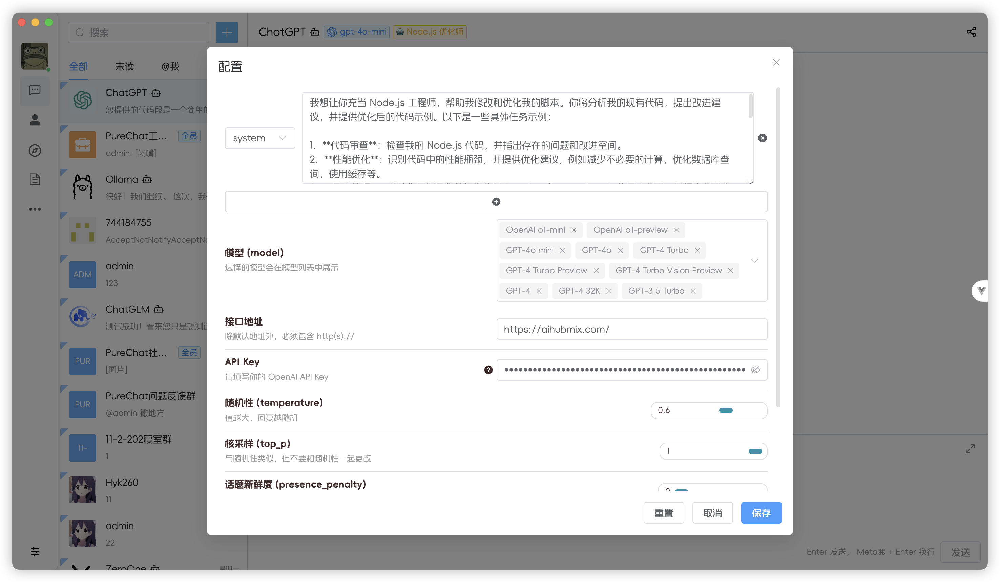

<p align="center">
  <a>
    
  </a>
  <h2 align="center" style="font-weight: 600;font: bold 200% Consolas, Monaco, monospace;color: #999;" >
    PureChat
  </h2>
  <p align="center">
    <span>聊天应用与AI开发框架</span>
    <br />
    <a href="https://pureadmin.cn" target="blank">
      <strong>🌎 在线预览</strong>
    </a>
    &nbsp;&nbsp;|&nbsp;&nbsp;
    <a href="https://jq.qq.com/?_wv=1027&k=Cd4Ihd2J" target="blank">
      <strong>💬 联系作者</strong>
    </a>
    <br />
    <br />
  </p>
</p>

[![Web][Web-image]][web-url]
[![Windows][Windows-image]][download-url]
[![MacOS][MacOS-image]][download-url]

[web-url]: https://pureadmin.cn
[download-url]: https://github.com/Hyk260/PureChat/releases
[Web-image]: https://img.shields.io/badge/Web-orange?logo=microsoftedge
[Windows-image]: https://img.shields.io/badge/-Windows-blue?logo=windows
[MacOS-image]: https://img.shields.io/badge/-MacOS-black?logo=apple

[](https://github.com/Hyk260/PureChat/blob/master/LICENSE)
[](https://github.com/Hyk260/PureChat/stargazers)
[](https://github.com/Hyk260/PureChat/network/members)

## 简介

[反馈](https://github.com/Hyk260/PureChat/issues) /
[QQ 群](https://github.com/Hyk260/PureChat/discussions/2) /
[打赏开发者](./images/weix.png) /
[文档](https://hyk260.github.io/pure-docs) /
[更新日志](https://hyk260.github.io/pure-docs/other/logs.html)

[PureChat](https://github.com/Hyk260/PureChat) 是一个聊天工作室(腾讯 IM 即时通讯) 集成 ChatGPT(openai)

### 🎉 特性

- 📦️ 使用 Vite5 构建
- 📃 RBAC 模型 + JWT 权限控制
- 🤖 接入 openai 语言模型
- ☁️ 聊天工作室 `基于IM即时通讯sdk`
- 🌚 光明/黑暗 模式主题切换`自动根据系统主题改变`
- 📝 支持完整的`Markdown`渲染 流程图、代码高亮等
- 🔴 国际化支持 English, 简体中文
- 🔧 Prettier + ESLint 规范
- 🛡️ GitHub快速登录享受无缝的社交体验
- ✨ 提供桌面应用electron版本 支持 macOS(.dmg)、Windows(.exe)双平台
- 🛠 更多特性开发中

环境配置

```
本地环境需要安装 Node.js 18.20+
```

克隆代码

```bash
git clone https://github.com/Hyk260/PureChat.git
```

安装依赖

```
pnpm install
```

启动项目

```
pnpm dev
```

打包

```
pnpm build
```

### 🖼️ 截图



